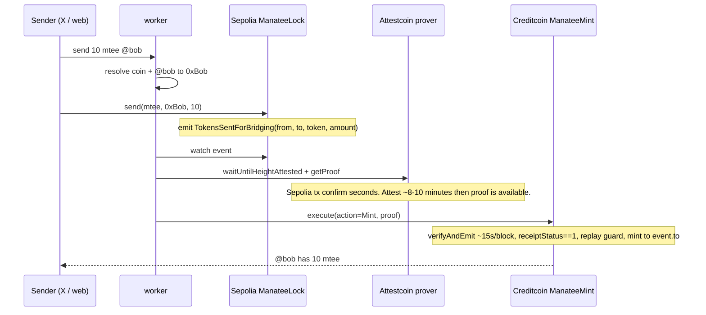

# manatee

Social cross-chain send. One command `send 10 mtee @bob` locks allowlisted ERC20 on Sepolia (recipient + token in the event) then Attestcoin-verified mint on Creditcoin CC3 testnet.

Hackathon track: **DeFi**. Name: **manatee**. Repo: public ([github.com/ducnmm/manatee](https://github.com/ducnmm/manatee)).

Protocol details: [`docs/attestcoin.md`](docs/attestcoin.md).

## Attestcoin Integration Summary

> manatee locks allowlisted tokens on Ethereum Sepolia with recipient and token in `TokensSentForBridging`. An off-chain worker builds Merkle and continuity proofs via `@gluwa/usc-sdk`. `ManateeMint` on Creditcoin CC3 testnet calls the Block Prover precompile, checks receipt status, rejects replays, and mints the mapped token only to the attested event `to` / `token`. The social command never chooses recipient or asset. CTC is gas only.

## Trust model

The tweet/web command is UX. Settlement reads the attested Sepolia event. The worker cannot choose recipient or asset. CTC is gas only.

| Signal | Trusted for |
|---|---|
| Tweet / web (`@bob`, ticker `mtee`) | UX only. Used to *build* the Sepolia `send(token, to, amount)` the user signs. |
| `to`, `token`, `amount` | Attested Sepolia event `TokensSentForBridging(from, to, token, amount)`. `ManateeMint` mints that mapped token to that `to`. |
| Worker after lock | Submits Merkle + continuity proofs. Cannot pick recipient or asset at mint time. |
| Replay | `processedQueries[keccak(chainKey, blockHeight, txIndex)]` on the ASC. |
| Tx success | `receiptStatus == 1` in `ManateeMint`. The Block Prover precompile does **not** check this. |
| CTC | Creditcoin gas for `verifyAndEmit` / mint. Not a sendable coin (`send … ctc` is rejected). |

If the worker swapped `@bob` or the ticker when building the Sepolia call, the user would still have to sign `send(token, to, amount)`. The event is the source of truth.

## Architecture



Two waits. Do not treat the Sepolia explorer link as minted.

| Step | Time | Meaning |
|---|---|---|
| 1. Sepolia `send` | seconds | Lock tx mined. mtee is in `ManateeLock`. |
| 2. Attestcoin attest | **~8–10 minutes** | Creditcoin attestors have that Sepolia block. Proof builder can `getProof`. Bob still has no Creditcoin mtee. |
| 3. Creditcoin `execute` | ~1 block (~15s) | `verifyAndEmit`, then mint. Cross-chain send is done. |

## Stack

- Foundry, Solidity 0.8.23, OpenZeppelin ERC20
- TypeScript, ethers v6
- `@gluwa/usc-sdk` 0.18.0
- `@gluwa/usc-contracts` (`EvmV1Decoder`)

`ASCBase` / `VerifierInterface` are copied from [gluwa/attestcoin-protocol-examples](https://github.com/gluwa/attestcoin-protocol-examples) (attribution in the Solidity files). New logic is the lock event with `to` + `token`, and minting that mapped token to `event.to`.

## Setup

- Node 20+
- Foundry (`foundryup`)
- A **new** wallet (`cast wallet new`). No real funds. Same key on Sepolia and Creditcoin.

```bash
npm install
git submodule update --init --recursive   # forge-std
cp .env.example .env
```

Fill `.env`:

| Var | Value |
|---|---|
| `SOURCE_CHAIN_KEY` | `1` — Attestcoin chain key for Sepolia. **Not** chainId `11155111`. |
| `SOURCE_CHAIN_RPC_URL` | Sepolia HTTP RPC (e.g. Infura). |
| `PROOF_BUILDER_URL` | `https://prover.cc3-testnet.creditcoin.network` |
| `CREDITCOIN_RPC_URL` | `https://rpc.cc3-testnet.creditcoin.network` |
| `PRIVATE_KEY` | Test wallet only. |

Faucets:

- Sepolia ETH: [Google Sepolia faucet](https://cloud.google.com/application/web3/faucet/ethereum/sepolia)
- CTC: Creditcoin Discord `/faucet address: 0x…` — **100 CTC / 24h**, enough for ~9 oracle queries (testnet fees are intentionally high). Do not spam `verifyAndEmit`.

Export the file before `forge` / `tsx` (Foundry does not read the repo-root `.env` unless the vars are in the environment):

```bash
set -a && source .env && set +a
```

## Deploy

Sepolia first (`ManateeToken` + `ManateeLock`; script mints 1_000_000 mtee to the deployer):

```bash
forge script script/DeploySepolia.s.sol --root contracts --rpc-url $SOURCE_CHAIN_RPC_URL --broadcast --private-key $PRIVATE_KEY
```

Put the logged addresses into `.env` as `SEPOLIA_LOCK` and `SEPOLIA_MTEE`. Creditcoin deploy reads both.

Creditcoin next. **Link** the already-deployed CC3 testnet `EvmV1Decoder` so we do not spend faucet CTC deploying another copy:

```bash
cd contracts
forge script script/DeployCreditcoin.s.sol \
  --profile creditcoin \
  --rpc-url $CREDITCOIN_RPC_URL \
  --broadcast \
  --private-key $PRIVATE_KEY
```

`--profile creditcoin` links the existing testnet decoder `0x731c345d79Fb8BbDC541f9DF3b6317585F849F9f`. Do **not** omit the profile: a default-profile broadcast deploys another decoder and burns faucet CTC.

Fill `CREDITCOIN_MINT` and `CREDITCOIN_MTEE` in `.env`. Re-`source` `.env`.

## Demo: web + X

Same command: `@manatee send 10 mtee @bob`. Register / faucet / sign on the site. X bot polls mentions.

Live: [manatee-production.up.railway.app](https://manatee-production.up.railway.app) — one Railway service (web + API + chain worker + X poller). Mentions are `@manatee`. Replies post as `@DugongWallet` via twitterapi.io (same posting session as dugong; we did not copy dugong's OAuth, markets, or databases).

```bash
npm run server     # API + chain worker + X poller  http://127.0.0.1:8787
npm run web        # Vite UI with /api proxy         http://127.0.0.1:5173
```

- **Web:** connect MetaMask (Sepolia), register `@handle`, faucet 10 `mtee`, send (you sign `ManateeLock.send`).
- **X:** tweet `@manatee send 10 mtee @bob`. Two replies: (1) locked on Sepolia + explorer, waiting Attestcoin ~8–10 min; (2) minted on Creditcoin + explorer. Needs `TWITTERAPI_IO_API_KEY` + login cookies + proxy. Without the key, web still works.
- Keep `npm run server` up after a web send so attest → mint runs.

Parser allowlist is `mtee` only. `ctc` → `ctc is gas`. Unknown tickers / `eth` → reject.

Tweet this:

```
https://x.com/intent/tweet?text=%40manatee%20send%2010%20mtee%20%40bob
```

`npm run worker` is the chain watcher only (lock event → proof → mint). `npm run server` already starts it unless `START_CHAIN_WORKER=0`.

## Tests

```bash
npm test                  # parser + registry (node:test)
npm run test:contracts    # forge test --root contracts
# equivalent:
forge test --root contracts
```

Contract tests mock the Block Prover precompile: happy path, replay, `receiptStatus != 1`, wrong lock address, unmapped token.

## Addresses

CC3 testnet, 2026-09-01. E2E: `@alice` locked 10 mtee on Sepolia; after attest, `@bob` received 10 mtee on Creditcoin. Alice's CC3 balance stayed 0 (mint follows event `to`, not the sender).

| Contract | Network | Address |
|---|---|---|
| `ManateeLock` | Ethereum Sepolia | [`0x910de3bc27535ffAc777678aa1eee5990AfB1fce`](https://sepolia.etherscan.io/address/0x910de3bc27535ffAc777678aa1eee5990AfB1fce) |
| `ManateeToken` (`mtee`) | Ethereum Sepolia | [`0x107aC3a8f5d96e10750F46eD3f013A9e86F4a3C4`](https://sepolia.etherscan.io/address/0x107aC3a8f5d96e10750F46eD3f013A9e86F4a3C4) |
| `ManateeMint` | Creditcoin CC3 testnet | [`0xEC2AEB402a04b966314527f2c007e354C38309e4`](https://creditcoin-testnet.blockscout.com/address/0xEC2AEB402a04b966314527f2c007e354C38309e4) |
| `ManateeToken` (`mtee`) | Creditcoin CC3 testnet | [`0x107aC3a8f5d96e10750F46eD3f013A9e86F4a3C4`](https://creditcoin-testnet.blockscout.com/address/0x107aC3a8f5d96e10750F46eD3f013A9e86F4a3C4) |

| Tx | Explorer |
|---|---|
| Sepolia lock (10 mtee → Bob) | [0x01c3ab65…](https://sepolia.etherscan.io/tx/0x01c3ab656536c7cda4e31170caab89d56da26d1ea04ba26febe4e2e65583bf1e) |
| Creditcoin mint (10 mtee to Bob) | [0xa904a4d2…](https://creditcoin-testnet.blockscout.com/tx/0xa904a4d2f31d83f0e70d8d72581d9341a738f5afe1d840b935378d16a3541c2b) |

Handles used: `@alice` = `0xEEBDF2aa0ADA2C78b55328Ba0cDD59367865d778`, `@bob` = `0x31e5cb07c9B62e8afE302D724662aC2218081A2D`.

Explorers: [Sepolia Etherscan](https://sepolia.etherscan.io) · [Creditcoin CC3 testnet Blockscout](https://creditcoin-testnet.blockscout.com)

Decoder library (do not redeploy): [`0x731c345d79Fb8BbDC541f9DF3b6317585F849F9f`](https://creditcoin-testnet.blockscout.com/address/0x731c345d79Fb8BbDC541f9DF3b6317585F849F9f)

## What we did not build

Not in this repo:

- USDC / USDT (no Circle token, no mock Tether)
- Reverse bridge (Creditcoin → Sepolia)

Also out of scope: native ETH/CTC send, arbitrary ERC20, on-chain names.
