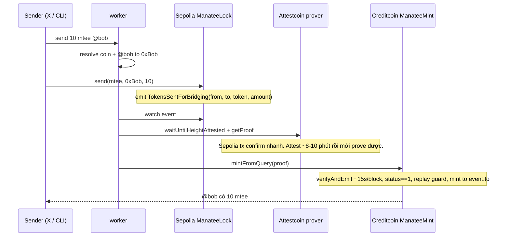

# manatee — BUIDL CTC 2026 Fall

Social **cross-chain send**. Một chức năng: chuyển coin. Tweet (hoặc lệnh giống tweet) chỉ là UX. Tiền chỉ nhả trên Creditcoin sau khi Attestcoin verify tx Sepolia.

Tên repo / DoraHacks / bot: **manatee** (không viết hoa). Track: **DeFi**. Coin gửi: allowlist (**mtee** bắt buộc; thêm được vài ticker). Gas: **CTC** + Sepolia ETH — không gửi bằng lệnh.

Deadline nộp: **13/09/2026 23:59 ET** = **14/09/2026 10:59 VN**. Công bố winner 20/09.

Không fork [dugong](https://github.com/ducnmm/dugong). Repo mới, code mới. Chỉ giữ ý: “gửi coin bằng một câu lệnh”.

---

## 1. Sản phẩm (một câu)

`@manatee send 10 mtee @bob` → lock/burn token trên Sepolia (event có `to` + `amount` + **token**) → worker lấy Merkle + continuity proof → ASC trên Creditcoin mint **đúng token đó** cho Bob.

Cú pháp: `send <amount> <coin> @handle`. `<coin>` bắt buộc, phải nằm trong allowlist. Ticker lạ / `ctc` → reject.

Bot **không** chọn người nhận. Người nhận nằm trong event đã được attest.



Đó là Hello Bridge (tutorial 1) + offchain worker (tutorial 3) + **recipient trong event** (điểm khác dugong và khác example mint-to-self).

### Coin

Được gửi **một số coin**, không gửi tùy ý. Allowlist on-chain + parser.

| Ticker | P0 / P1 | Gửi? | Ghi chú |
|---|---|---|---|
| **mtee** | P0 | Có | ERC20 mình deploy 2 chain. Demo chắc. |
| **usdc** | P1 | Có nếu kịp | Ưu tiên Circle USDC Sepolia (`0x1c7D4B196Cb0C7B01d743Fbc6116a902379C7238`) + faucet. Fallback: mock USDC mình mint. |
| **usdt** | P1 | Có nếu kịp | **Không** có Tether official trên Sepolia. Tự deploy mock USDT (6 decimals), mint test, lock như mtee. README ghi `test usdt`, đừng claim Tether. |
| **ctc** | — | Không | Gas. Không có trên Sepolia → không attest. |
| **eth** | — | Không | Native Sepolia. Attestcoin examples dùng ERC20 + custom event, đừng wrap ETH trong 12 ngày. |
| ERC20 lạ | — | Không | Không “any token”. |

`manatee` = bot. Ticker trong lệnh viết thường (`mtee`, `usdc`, `usdt`).

Thêm coin = thêm 1 dòng allowlist + 1 ERC20 Creditcoin + mapping. **Không** copy-paste worker. Event ngày 1 đã có field `token` nên P1 không phá P0.

P1 tối đa **usdc + usdt** sau khi `mtee` xanh. Đừng ship 3 ticker cùng lúc ngày đầu. `usdt` và `mtee` cùng pattern (token mình mint); `usdc` Circle mới là tích hợp token người khác.

Quy tắc: coin phải lock được trên **Sepolia**. Worker không được chọn token lúc mint — đọc từ event đã verify.

### 10 phút nghĩa là gì

Không phải “bấm send rồi 10 phút Sepolia mới mined”.

| Mốc | Thời gian | Ý nghĩa |
|---|---|---|
| 1. Sepolia `send` | vài giây | Tx **đã thành công** trên Ethereum. mtee đã lock. Explorer hiện xanh. |
| 2. Attest | **~8–10 phút** | Creditcoin mới **tin** block đó. Chưa mint. Bob **chưa** có mtee. |
| 3. Mint Creditcoin | ~15 giây | Bridged transfer **xong**. Bob có 10 mtee. |

Giao dịch nguồn thành công ngay. Giao dịch **cross-chain** (Alice hết mtee Sepolia → Bob có mtee Creditcoin) xong sau ~10 phút. UX: reply tweet “locked, waiting for attest” rồi “minted”. Không fake instant.

---

## 2. Việc không làm

- Prediction market, reward campaign, TEE/Nautilus, Enoki, Sui/Move
- Reverse bridge Creditcoin → Sepolia
- Arbitrary ERC20 / native ETH / gửi CTC
- Frontend đẹp (một trang register + link explorer là đủ)
- Nộp lại code dugong / copy nguyên `attestcoin-protocol-examples`

---

## 3. Trust model (để khỏi trượt đề)

| Tín hiệu | Ai được tin |
|---|---|
| `@bob` + ticker trên tweet | Worker (chỉ để **tạo** tx Sepolia) |
| `to`, `amount`, `token` on-chain | Event Sepolia, sau Attestcoin verify |
| Replay | `processedQueries` trên ASC |
| Tx có thành công không | `receiptStatus == 1` (precompile **không** check cái này) |

Nếu worker đổi `@bob` hoặc ticker lúc gửi Sepolia, user vẫn phải **ký** `send(token, to, amount)`. Tweet là lệnh, **event là source of truth**.

---

## 4. Stack

Lấy toolchain của Gluwa, không mang Rust workspace dugong.

| Lớp | Chọn |
|---|---|
| Contracts | Foundry, Solidity `^0.8.23`, OpenZeppelin ERC20 |
| Worker | TypeScript, ethers v6, `@gluwa/usc-sdk` |
| CLI | Cùng parser với tweet (`send 10 mtee @bob`) |
| X | P1. P0 = CLI + log dạng tweet |
| Web | Optional: form `register` + 2 explorer link |
| Deploy | Sepolia + **CC3 testnet** |

Môi trường testnet (không đụng mainnet):

- Sepolia `chainKey = 1` (không phải chainId `11155111`)
- Creditcoin RPC: `https://rpc.cc3-testnet.creditcoin.network`
- Proof builder: `https://prover.cc3-testnet.creditcoin.network` (đúng `.env` examples; docs đôi chỗ ghi URL khác)
- BlockProver precompile: `0x0000000000000000000000000000000000000FD2`
- Decoder (testnet): `0x731c345d79Fb8BbDC541f9DF3b6317585F849F9f`
- Faucet Sepolia: [Google](https://cloud.google.com/application/web3/faucet/ethereum/sepolia)
- Faucet CTC: Discord Creditcoin `/faucet address: 0x…` — **100 CTC / 24h**, đủ ~9 query (phí testnet cố ý cao)

Hai khoảng chờ khác nhau (đừng nhầm “confirm”):

1. **Sepolia confirm** — vài giây / vài block. Tx lock mtee xong là xong trên Ethereum.
2. **Attestcoin attest** — official docs: **~8–10 phút** với Sepolia. Attestor neo block đó lên Creditcoin, chống reorg. Proof builder mới `waitUntilHeightAttested` được. Đây không phải “CTC confirm chậm”.
3. **Creditcoin verify + mint** — sau khi đã attest, `verifyAndEmit` trong **~1 block (~15 giây)**.

Demo: lock xong nói “đang chờ attest”, đừng cut 10 phút thành instant.

Tham chiếu bắt buộc trước khi viết contract:

1. [Hello Bridge](https://github.com/gluwa/attestcoin-protocol-examples/blob/main/hello-bridge/README.md)
2. [Custom Contracts Bridging](https://github.com/gluwa/attestcoin-protocol-examples/blob/main/custom-contracts-bridging/README.md)
3. [Bridge Offchain Worker](https://github.com/gluwa/attestcoin-protocol-examples/blob/main/bridge-offchain-worker/README.md)
4. [`ASCMinter.sol`](https://github.com/gluwa/attestcoin-protocol-examples/blob/main/contracts/sol/ASCMinter.sol)

---

## 5. Repo layout

```
manatee/
  README.md                 # judge đọc cái này trước
  docs/attestcoin.md        # setup + cách protocol được dùng
  contracts/                # Foundry
    src/
      sepolia/ManateeLock.sol
      creditcoin/ManateeMint.sol
    test/
    script/
  worker/                   # watch + prove + mint
  cli/                      # manatee send | register
  web/                      # optional
```

Local: `/Users/ducnmm/Documents/ducnmm/manatee`. GitHub: `https://github.com/ducnmm/manatee` (public).

Token: P0 `mtee` (18 decimals, mình mint 2 chain). P1 `usdc` / `usdt` (6 decimals). Gas: Sepolia ETH + Creditcoin `CTC`.

---

## 6. Contracts

### 6.1 Sepolia — `ManateeLock`

Vault allowlist. P0 chỉ `mtee` (có thể gộp ERC20 `mtee` + `send` trong một contract). P1 `allowed[token] = true` cho USDC / mock USDT. **Custom event**, không dùng `Transfer` để trigger.

```solidity
event TokensSentForBridging(
    address indexed from,
    address indexed to,
    address indexed token,
    uint256 amount
);

function send(address token, address to, uint256 amount) external;
// require allowed[token]; lock/burn; emit TokensSentForBridging
```

`token` + `to` + `amount` đều trong event. Worker không được mint coin khác.

### 6.2 Creditcoin — `ManateeMint` (ASC + ERC20, pattern combined như SimpleMinterASC)

Entry: `mintFromQuery(...)` cùng shape proof với examples.

Trong **một** tx:

1. Replay key = `keccak(chainKey, blockHeight, txIndex)` — `require(!processedQueries[key])`
2. `VERIFIER.verifyAndEmit(...)` tại `0x0FD2`
3. Decode tx bytes (`EvmV1Decoder` / decoder testnet)
4. `receiptStatus == 1`
5. Log đúng `TokensSentForBridging` từ **đúng** address `ManateeLock`
6. Đọc `token` từ event → `sepoliaToken => creditcoinToken` mapping (P0: chỉ mtee)
7. Mint **token đó** cho `to` theo `amount` trong event — không theo calldata worker
8. `processedQueries[key] = true` (set sau verify, trước mint)

Worker chỉ submit proof. Worker không chọn token / recipient.

### 6.3 Registry handle (mỏng)

P0: file `registry.json` + CLI `manatee register @bob 0x…`
P1: contract `ManateeNames` trên Creditcoin: `register(bytes32 handleHash, address account)` owner = signer.

Worker resolve `@bob` + ticker → `send(token, to, amount)`. ASC không đọc registry hay ticker tweet.

---

## 7. Worker + CLI

Parser (tweet và CLI dùng chung):

```
@manatee send <amount> <coin> @handle
@manatee register <0xaddress>
```

Ví dụ: `@manatee send 10 mtee @bob`. `<coin>` bắt buộc, allowlist. P0: `mtee`. P1: `usdc`, `usdt`. `ctc` → reject + hint “ctc is gas”.

Worker loop (copy ý tutorial 3, code mới):

1. Poll Sepolia logs `TokensSentForBridging` từ `ManateeLock`
2. `proofBuilder.waitUntilHeightAttested(1, blockNumber)`
3. `proofBuilder.getProof(txHash)`
4. `ManateeMint.mintFromQuery(...)` bằng ví worker (trả gas CTC, **không** được đổi `to` / token)
5. Log 2 explorer link; nếu có X thì reply thread

CLI P0 (demo chắc):

```bash
manatee register @alice 0xA
manatee register @bob 0xB
manatee send 10 mtee @bob     # ký Sepolia send, đợi attest ~8-10p, rồi mint
manatee status <txHash>
```

X P1: poll mention như dugong-worker. Nếu API X không sẵn — **không block nộp**. Video: screenshot câu lệnh + CLI chạy thật.

---

## 8. Lịch 12 ngày (1 → 13/09)

| Khi | Việc | Xong khi |
|---|---|---|
| **1–2/09** | Clone examples. Wallet mới (không tiền thật). Faucet Sepolia + CTC. Chạy **Hello Bridge** end-to-end. | Có 1 mint BTKT trên CC3 testnet + hiểu chờ 8–10 phút |
| **3/09** | Tutorial 2: deploy lock + minter của **mình** (có thể mint-to-self trước) | `cast` burn → `mintFromQuery` → balance |
| **4/09** | Đổi event thành `TokensSentForBridging(from,to,amount)`. Test Foundry: happy path, replay, status≠1, sai lock address | `forge test` xanh |
| **5–6/09** | Worker TS: watch → wait attest → getProof → mint. CLI `send` | Một lệnh CLI ra 2 tx hash |
| **7/09** | Registry handle. Parser tweet. Reply/log explorer | `send 10 mtee @bob` mint đúng 0xBob |
| **(P1)** | Allowlist `usdc` / `usdt` nếu P0 đã xanh | `send 1 usdt @bob` mint đúng bridged token |
| **8/09** | X worker nếu còn key; không thì CLI + fake tweet trong README | Quyết định P1 live X hoặc bỏ |
| **9/09** | E2E testnet sạch. Quay demo **không cut** đoạn chờ attest | Video ≤ 3 phút |
| **10/09** | README judge, `docs/attestcoin.md`, deck 6–8 slide, diagram | Người lạ làm theo README được |
| **11/09** | Edge: double submit, handle lạ, coin lạ, amount 0, worker down giữa chừng | Ghi known limits |
| **12–13/09** | Form DoraHacks. Buffer faucet 24h | Submitted trước 13/09 23:59 ET |

Không kịp X thì vẫn nộp. Không kịp worker tự động thì script `submit_query` như Hello Bridge vẫn **đủ Attestcoin** — kém UX hơn, vẫn in-scope. Worker là mục tiêu; proof+ASC là bắt buộc.

---

## 9. Nộp DoraHacks

- **Name:** manatee
- **Sector:** DeFi
- **Repo:** public, README có setup + architecture + **Attestcoin Integration Summary**
- **Demo video:** 1 lệnh send, hiện event Sepolia, chờ attest, mint Creditcoin, balance `@bob`
- **Deck:** problem (bot/bridge tin tập trung) → Attestcoin verify → social UX
- Testnet addresses + 1 tx Sepolia + 1 tx Creditcoin trong README
- Team: 1 người. Bio/role/country. Không claim Solidity production nếu chưa có — nói Foundry + examples + ship testnet

Câu Attestcoin (dán form):

> manatee locks allowlisted tokens on Ethereum Sepolia with recipient and token in `TokensSentForBridging`. An off-chain worker builds Merkle and continuity proofs via `@gluwa/usc-sdk`. `ManateeMint` on Creditcoin CC3 testnet calls the Block Prover precompile, checks receipt status, rejects replays, and mints the mapped token only to the attested event `to` / `token`. The social command never chooses recipient or asset. CTC is gas only.

---

## 10. Rủi ro

| Rủi ro | Xử lý |
|---|---|
| X API trả phí / die | CLI là happy path nộp bài |
| Proof URL docs ≠ examples | Dùng `https://prover.cc3-testnet.creditcoin.network` |
| Hết CTC faucet (9 query/ngày) | Ít lần thử; ví riêng; không spam verify |
| Attest ~10 phút | Quay video 1 take; README nói delay |
| Copy examples quá giống | Recipient trong event + lệnh `mtee` + docs “bot không settle” |
| Solidity mới | Bám `ASCMinter.sol`; không tự invent proof format |

---

## 11. Definition of done

1. `ManateeLock` Sepolia + `ManateeMint` CC3 testnet, verified/explorer
2. `forge test` cover verify-path mocks + replay + bad status
3. Một send: Alice → Bob, Bob balance tăng đúng `amount`
4. README + video + deck + form Attestcoin summary
5. Không còn prediction/TEE/Sui trong scope

Ngày 1 làm ngay: wallet mới, faucet 2 chain, chạy Hello Bridge trước khi mở repo `manatee`.

---

## Notes (chỗ chỉnh cùng nhau)

Sửa trực tiếp các mục trên, hoặc ghi ý ở đây:

- Allowlist: P0 `mtee`. P1 `usdc` (Circle hoặc mock) + `usdt` (mock, không có Tether official Sepolia). Không `ctc` / ETH / arbitrary ERC20.
- Event có `token` từ ngày 1. Worker không chọn coin lúc mint.
- Sepolia confirm vài giây. Cross-chain xong sau attest ~8–10 phút.
-
